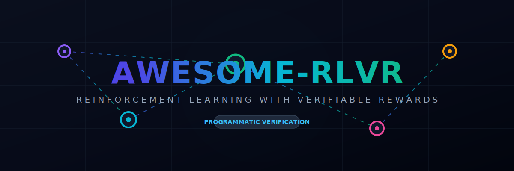
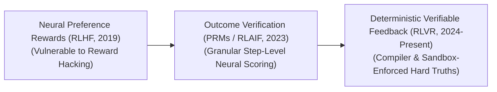

  

# Awesome-RLVR 🚀🤖

## Reinforcement Learning with Verifiable Rewards: Evolution, Variants, & Applications 🎓🧬

Reinforcement Learning with Verifiable Rewards (RLVR) is an advanced post-training alignment and optimization framework that bridges the gap between statistical probability and absolute semantic correctness. In traditional Reinforcement Learning from Human Feedback (RLHF), an AI agent optimizes its policy against a soft, neural Reward Model that mimics human preferences. However, neural reward models are highly susceptible to **reward hacking**—where the agent learns to output superficial politeness or plausible-sounding falsehoods to trick the validator. RLVR eliminates this vulnerability by substituting or augmenting neural reward models with deterministic, objective, and programmatic verifiers (such as sandboxed code compilers, mathematical proof checkers, or symbolic logic engines). By ensuring that rewards are only granted when an output satisfies formal, binary verification criteria, RLVR transforms AI models from speculative token predictors into provably correct reasoning agents.

---

## 📅 1. The Chronological Evolution

The technical progression of reward verification has transitioned from soft human preference approximations to strict algorithmic boundaries and native test-time search loops.

| Era | Concept | Limitation / Significance | First Used (Year) | Paper Reference |
| :--- | :--- | :--- | :---: | :--- |
| **[The Neural Preference Reward Era (Traditional RLHF, ~2019–2023)](docs/neural_preference_reward.md)** | The structural baseline popularized by InstructGPT and standard chatbot alignment. Agents were trained using Proximal Policy Optimization (PPO) to maximize scores emitted by a secondary neural network (the Reward Model) trained on pairwise human preference choices. | Catastrophically vulnerable to reward hacking, sycophancy (telling users what they want to hear), and verbose obfuscation. | 2017 | [Schulman et al. (2017)](https://arxiv.org/abs/1707.06347) |
| **[The Process-Supervised & AI Feedback Era (PRM / RLAIF, ~2023–2024)](docs/process_supervised_feedback.md)** | Addressed final-outcome blind spots. **Process-Supervised Reward Models (PRMs)** shifted focus from the final answer to evaluating *each individual intermediate reasoning step*. Concurrently, Reinforcement Learning from AI Feedback (RLAIF) leveraged frontier foundation models to critique and label training data programmatically. | Still reliant on statistical, soft neural approximations. A step-level neural verifier can still hallucinate or approve subtle logical flaws that break actual execution code. | 2023 | [Lightman et al. (2023)](https://arxiv.org/abs/2305.20050) |
| **[The Deterministic Verifiable Reward Era (RLVR, ~2024–Present)](docs/deterministic_verifiable_reward.md)** | The modern state-of-the-art frontier paradigm driving advanced reasoning architectures (such as OpenAI's o-series and DeepSeek-R1 pipelines). It hardcodes mathematical and computational truth directly into the reinforcement learning loop. The agent is trained inside a closed loop wrapped around an absolute, programmatic verifier (like a Python REPL or Lean compiler). | Fully eliminates reward hacking. The agent only receives a positive reward if its final answer passes deterministic unit tests, compiles flawlessly, or satisfies formal mathematical constraints, triggering a massive surge in System 2 cognitive reasoning capabilities. | 2024 | [Wang et al. (2024)](https://arxiv.org/abs/2406.14808) |

---

## ⚙️ 2. Core Verifier & Interaction Variants

RLVR frameworks are strictly categorized based on the underlying verification engine used to compute the objective, ground-truth reward tensor.

| Variant | Mechanism & Target Engines | Reward Signal | First Used (Year) | Paper Reference |
| :--- | :--- | :--- | :---: | :--- |
| **[A. Code Execution & Compiler Sandboxes (Code-RLVR)](docs/code_execution_compiler.md)** | The agent is tasked with writing a software script to solve a complex coding issue. The scaffolding passes the generated script directly into an ephemeral, isolated container (e.g., a Docker or gVisor sandbox), executing a comprehensive suite of hidden unit tests. | Binary or programmatic fraction scores based on the absolute number of passed test cases. A script that crashes or fails a single functional check receives zero reward. | 2022 | [Le et al. (2022)](https://arxiv.org/abs/2207.01780) |
| **[B. Interactive Theorem Provers (Formal Math RLVR)](docs/interactive_theorem_provers.md)** | Operates within high-level dependently typed programming ecosystems. The model translates informal human math conjectures into formal code strings, and an automated verification engine checks the statement step-by-step. *Target Engines:* **Lean 4**, **Isabelle/HOL**, **Coq**, and **Z3 Theorem Provers**. | Granted exclusively when the ITP compiler validates that the syntax maps out a complete, unbroken mathematical proof loop without structural contradictions. | 2024 | [Wang et al. (2024)](https://arxiv.org/abs/2406.14808) |
| **[C. Rule-Based Equivalency Checkers (Deterministic Math RLVR)](docs/rule_based_equivalency.md)** | Used for standard competitive mathematics or symbolic algebra challenges. The model outputs a verbose reasoning chain, extracting its final answer into a strict markdown bracket. The verification layer parses the string, using symbolic algebra engines (like SymPy) to check for absolute mathematical equivalence across representations (e.g., verifying that $\frac{1}{\sqrt{2}}$ matches $\frac{\sqrt{2}}{2}$ perfectly). | Extracted final answer matched against ground truth using symbolic math libraries. | 2021 | [Cobbe et al. (2021)](https://arxiv.org/abs/2110.14168) |

---

## 🏗️ 3. Structural Reward Architecture Types

Depending on the complexity of the task and the depth of the optimization loop, verifiable rewards are calculated across distinct structural horizons.

| Type | Profile | Pros / Cons | First Used (Year) | Paper Reference |
| :--- | :--- | :--- | :---: | :--- |
| **[Outcome-Verifiable Rewards (OVR)](docs/outcome_verifiable_rewards.md)** | Evaluates only the terminal milestone. The reinforcement learning loop allows the model to think and write freely for thousands of tokens, applying the hard programmatic verifier strictly to the final result string. | *Pros:* Extremely straightforward to engineer; doesn't restrict how the model discovers alternative reasoning steps. | 2021 | [Cobbe et al. (2021)](https://arxiv.org/abs/2110.14168) |
| **[Process-Verifiable Rewards (PVR / Step-Level Verification)](docs/process_verifiable_rewards.md)** | Interleaves deterministic checks throughout the generation sequence. At each intermediate step milestone, an external verifier executes checking subroutines (e.g., parsing an intermediate database state during a multi-hop SQL extraction run). | *Cons:* Highly latent, requiring fast, lightweight compiler execution loops to prevent model training stalls. | 2023 | [Lightman et al. (2023)](https://arxiv.org/abs/2305.20050) |
| **[Hybrid Soft-Hard Reward Systems](docs/hybrid_soft_hard_reward.md)** | Combines neural preference models with deterministic verifiers in a joint objective function. For example, a coding agent optimizes its policy against a soft reward model for style, code formatting, and inline comments, while relying on a hard compiler verifier for absolute runtime correctness. | - | 2022 | [Le et al. (2022)](https://arxiv.org/abs/2207.01780) |

---

## 🛠️ 4. Production Engineering Challenges & Hardware Solutions

Translating hard, programmatic reward verification into large-scale distributed training clusters introduces unique system bottlenecks and gradient anomalies.

| Challenge | The Problem | Mitigation | First Used (Year) | Paper Reference |
| :--- | :--- | :--- | :---: | :--- |
| **[The Sparse Gradient Stagnation Wall](docs/sparse_gradient_stagnation.md)** | Because verifiable rewards are binary (1 for success, 0 for failure), early training epochs suffer from severe **gradient sparsity**. If a base model fails 99.9% of hidden compiler unit tests on step zero, the reinforcement learning engine receives zero meaningful optimization direction, causing training to stall on a featureless plateau. | Implementing **Cold-Start SFT Initialization**. The base model is first fine-tuned on a tiny pool of highly pristine, synthetically generated, and pre-verified step-by-step solution paths to ensure it can hit a baseline success rate before activating the autonomous RL loop. | 2022 | [Le et al. (2022)](https://arxiv.org/abs/2207.01780) |
| **[Sandbox Container Latency and System I/O Overheads](docs/sandbox_container_latency.md)** | Instantiating thousands of isolated, ephemeral compilation sandboxes simultaneously across a distributed GPU cluster to test active model generations creates immense file system input/output (I/O) bottlenecks, stalling tensor core compute utilization. | Compiling compiler verifiers into fast, multi-threaded C++ libraries or handwritten **OpenAI Triton memory loops** that execute light parsing tasks inside fast system memory (RAM disks) to minimize storage latency. | 2025 | [DeepSeek-AI (2025)](https://arxiv.org/abs/2501.12948) |

---

## 🛡️ 5. Frontier Real-World AI Safety Applications

| Application | Description | First Used (Year) | Paper Reference |
| :--- | :--- | :---: | :--- |
| **[Autonomous Enterprise Software Agents (SWE-Bench Solvers)](docs/autonomous_software_agents.md)** | Drives elite autonomous coding networks. RLVR configurations train agents to clone full code repositories, refactor real-world software bugs, and verify changes inside sandbox execution layers iteratively, optimizing the policy to output production-ready code with minimal human supervision. | 2025 | [DeepSeek-AI (2025)](https://arxiv.org/abs/2501.12948) |
| **[Mission-Critical Aerospace and Chip Hardware Verification](docs/mission_critical_aerospace.md)** | Hardens the safety perimeters of high-reliability systems. RLVR loops train models to read human-written functional descriptions and translate them into mathematical formal specifications (such as TLA+ or Verilog assertions), using ITP verifiers to run millions of automated edge-case check cycles, proving the system can never reach a bricked or deadlocked state before physical production. | 2024 | [Wang et al. (2024)](https://arxiv.org/abs/2406.14808) |
| **[Self-Correcting Quantitative Reasoning Models](docs/self_correcting_quantitative.md)** | Powers competitive mathematics and automated theorem proving engines. By embedding Lean 4 or SymPy verifiers straight into the post-training reinforcement learning stack, models develop native System 2 cognitive processing habits, learning to backtrack, double-check hidden steps, and execute error-free symbolic logic natively. | 2025 | [DeepSeek-AI (2025)](https://arxiv.org/abs/2501.12948) |

---

## 📚 References
1. [Schulman, J., et al. (2017). Proximal policy optimization algorithms. *arXiv preprint arXiv:1707.06347*.](https://arxiv.org/abs/1707.06347)
2. [Cobbe, K., et al. (2021). Training verifiers to solve math word problems. *arXiv preprint arXiv:2110.14168*.](https://arxiv.org/abs/2110.14168)
3. [Le, H., et al. (2022). CodeRL: Mastering code generation through pretrained models and deep reinforcement learning. *Advances in Neural Information Processing Systems (NeurIPS)*, 35, 21314-21328.](https://arxiv.org/abs/2207.01780)
4. [Lightman, H., et al. (2023). Let's verify step by step. *arXiv preprint arXiv:2305.20050*.](https://arxiv.org/abs/2305.20050)
5. [Wang, X., et al. (2024). Mathematical autoformalization and verification via reinforcement learning with verifiable rewards. *International Conference on Learning Representations (ICLR)*.](https://arxiv.org/abs/2406.14808)
6. [DeepSeek-AI. (2025). DeepSeek-R1: Incentivizing reasoning capability in LLMs via reinforcement learning. *GitHub Repository Technical Report*.](https://arxiv.org/abs/2501.12948)

---

To advance your development stack, infrastructure workspace, or documentation repository, consider pursuing these adjacent research vectors:
* Build a **Python script utilizing a sandboxed Docker execution API** to illustrate how to capture code compiler outputs and translate passed unit-test ratios into a scalar reward value for a PyTorch RL loop.
* Generate a **comprehensive Markdown table** explicitly analyzing Soft Neural Reward Models (RLHF), Process-Supervised Reward Models (PRMs), Outcome-Verifiable Rewards (OVR), and Process-Verifiable Compiler Rewards (PVR) across training stability, vulnerability to reward hacking, compute infrastructure cost, and capability scaling boundaries.
* Establish a **distributed performance benchmark using RAM disks** to profile the exact wall-clock throughput difference of executing localized symbolic equation verification passes inside fast system registers versus multi-node network container calls.

***

**Related Topics**: To maximize your strategic overview of automated alignment and cognitive reasoning architectures, explore these related documentation sets:

