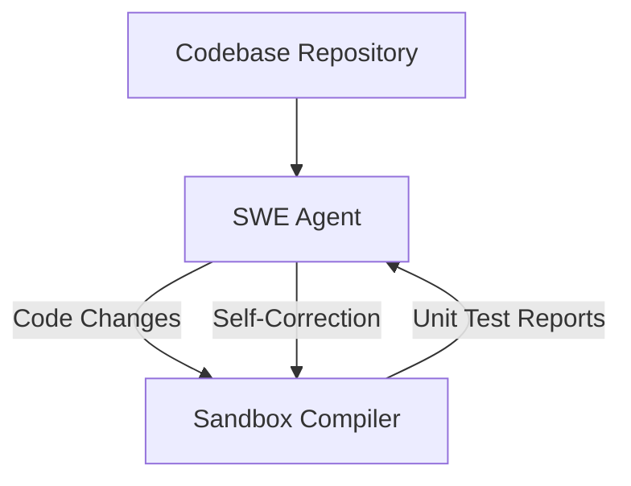

# Autonomous Enterprise Software Agents (SWE-Bench Solvers)

Using RLVR to train software engineering agents capable of solving real repository issues.

## How it Works
1. Agent clones target repositories and reads issues.
2. Writes code modifications.
3. Executes unit test suites iteratively in sandbox environments.
4. Learns to self-correct based on compiler and test errors.

## Mermaid Flow Diagram

[Back to README](../README.md)
