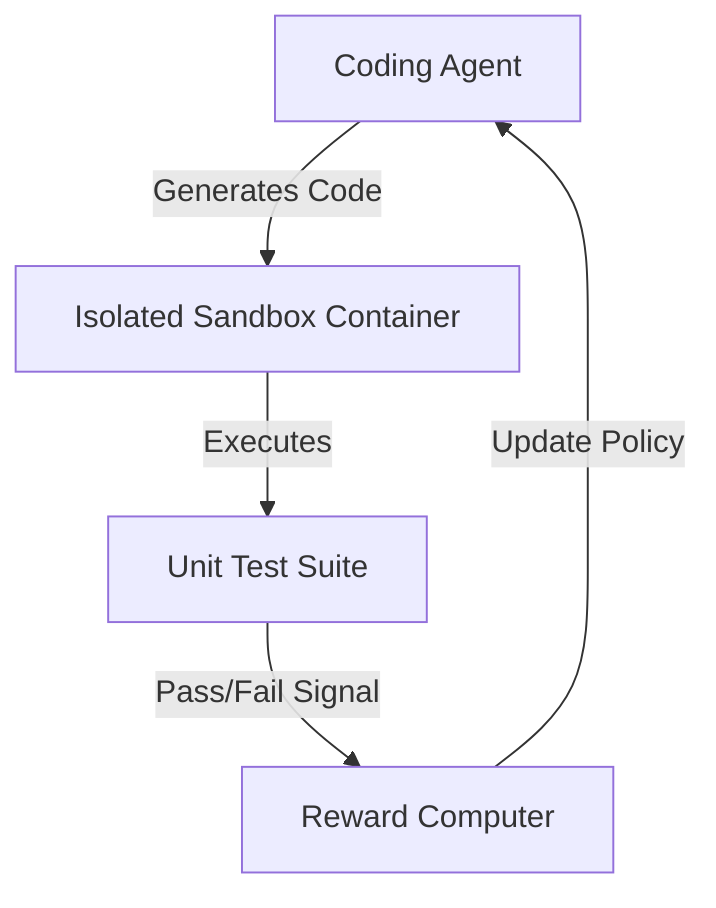

# Code Execution & Compiler Sandboxes (Code-RLVR)

Evaluating generated code directly by compiling and running it against test suites in isolated sandboxes.

## How it Works
1. Coding agent writes scripts to solve problems.
2. Code is sent to a sandboxed environment (Docker/gVisor).
3. Unit tests are executed.
4. Reward is computed based on test case pass rate.

## Mermaid Flow Diagram

[Back to README](../README.md)
