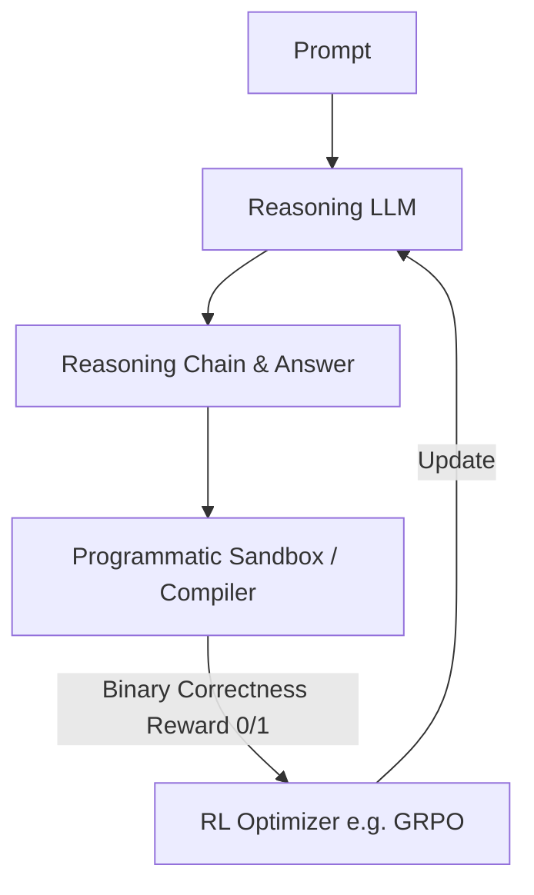

# Deterministic Verifiable Reward Era (RLVR)

Reinforcement Learning with Verifiable Rewards (RLVR) substitutes neural reward models with deterministic, programmatic verifiers.

## How it Works
1. Model generates answers containing formal statements or code.
2. An absolute verifier (compiler, REPL, or theorem checker) executes and verifies correctness.
3. Policy is optimized directly on binary/fractional verification outcomes.

## Mermaid Flow Diagram

[Back to README](../README.md)
