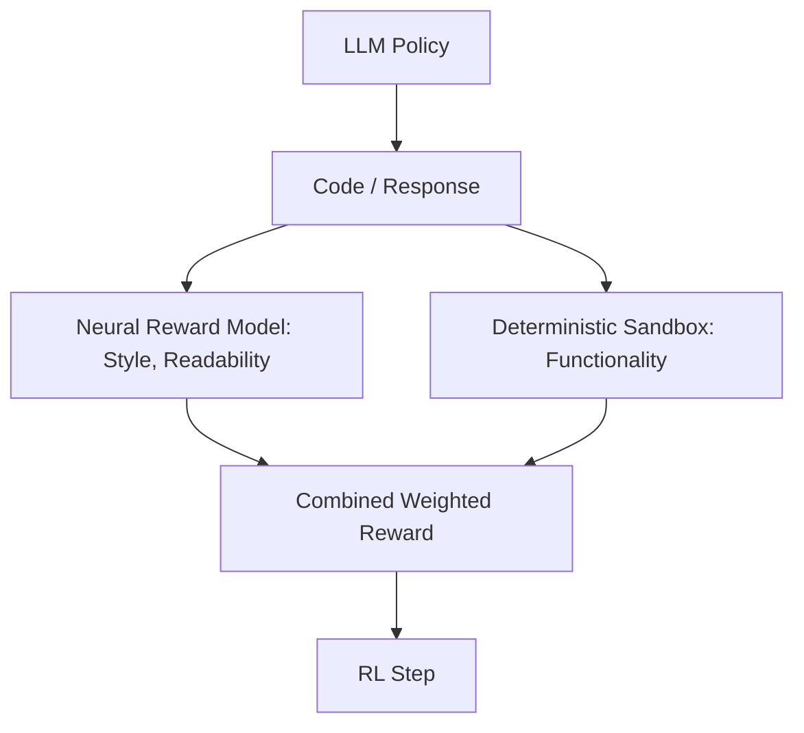

# Hybrid Soft-Hard Reward Systems

Combining neural reward models (soft) and deterministic verifiers (hard) to optimize policies.

## How it Works
1. Soft reward models grade stylistic qualities (e.g. comment quality, readability).
2. Hard verifiers check functional correctness (compilation, correctness).
3. Combined reward optimizes both functional validity and styling.

## Mermaid Flow Diagram

[Back to README](../README.md)
