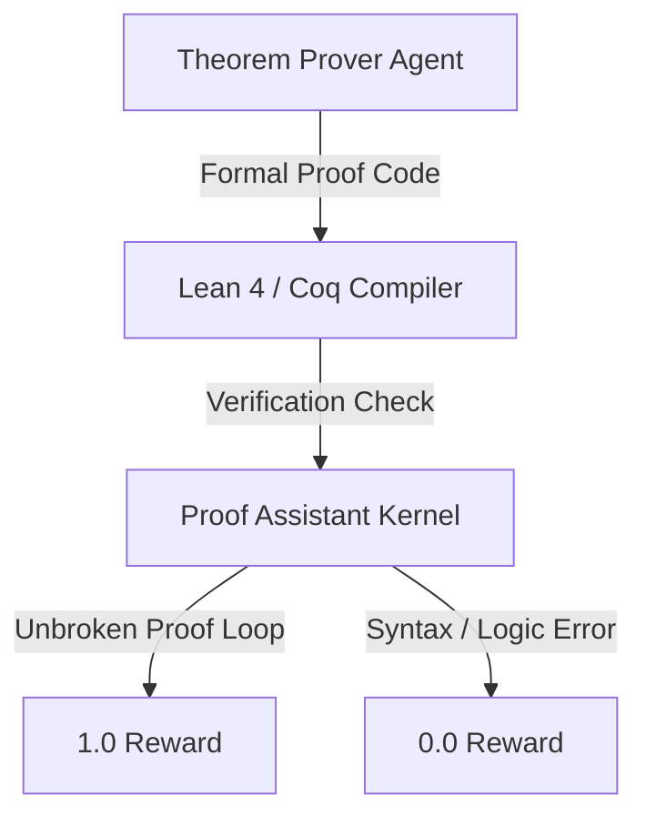

# Interactive Theorem Provers (Formal Math RLVR)

Using formal verification engines to check mathematical statements and proofs step-by-step.

## How it Works
1. The model outputs proofs in a formal language (e.g. Lean 4, Isabelle, Coq).
2. The theorem prover checks every step for logical validity.
3. Rewards are only given for complete, verified proofs.

## Mermaid Flow Diagram

[Back to README](../README.md)
