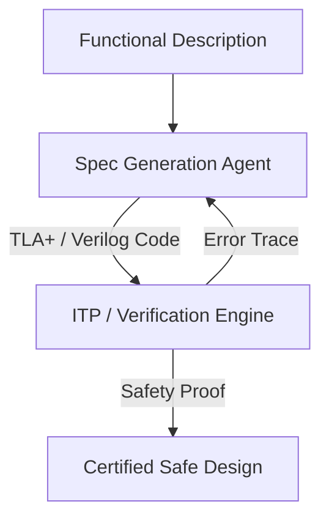

# Mission-Critical Aerospace and Chip Hardware Verification

Applying RLVR to critical hardware specification and system correctness proofs.

## How it Works
1. Generates formal specifications (e.g. Verilog assertions, TLA+).
2. Model checker / prover validates specification parameters.
3. Ensures deadlock-free and mathematically proven hardware state-spaces.

## Mermaid Flow Diagram

[Back to README](../README.md)
