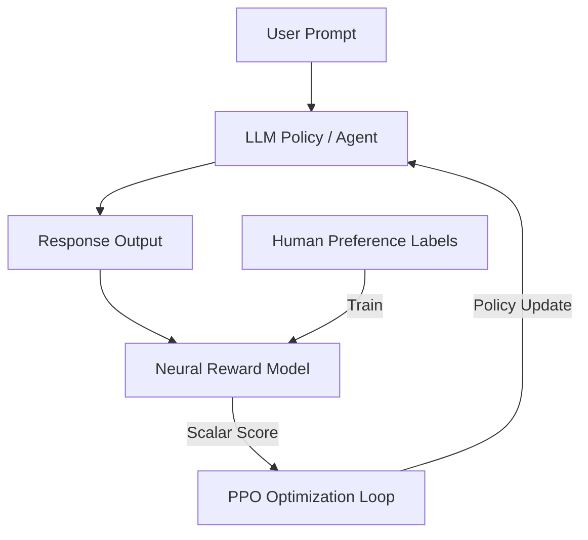

# Neural Preference Reward Era (Traditional RLHF)

Traditional Reinforcement Learning from Human Feedback (RLHF) utilizes a neural Reward Model to align language model outputs with human preferences. 

## How it Works
1. A base or SFT model generates multiple responses.
2. Humans label preferences (e.g. pairwise choices).
3. A neural Reward Model is trained on this data to output a scalar reward.
4. The policy is optimized using PPO against this neural reward model.

## Mermaid Flow Diagram

[Back to README](../README.md)
