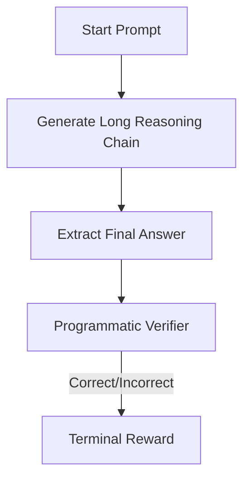

# Outcome-Verifiable Rewards (OVR)

OVR evaluates the agent's output at the very end of generation.

## How it Works
1. Policy generates a full response (thousands of reasoning tokens).
2. Verifier checks only the final outcome/answer.
3. No intermediate step constraints are enforced.

## Mermaid Flow Diagram

[Back to README](../README.md)
