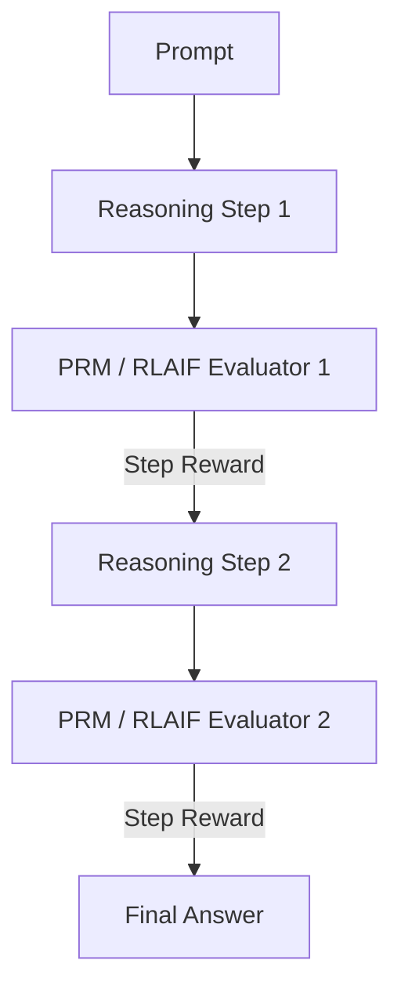

# Process-Supervised & AI Feedback Era (PRM / RLAIF)

Process-Supervised Reward Models (PRMs) evaluate individual intermediate steps instead of just the final outcome. AI feedback (RLAIF) automates label generation using LLMs.

## How it Works
1. The model generates a step-by-step reasoning chain.
2. A step-level verifier evaluates each reasoning step.
3. RLAIF uses LLMs as critiques/judges to label intermediate steps.
4. Helps guide the model through complex multi-step reasoning.

## Mermaid Flow Diagram

[Back to README](../README.md)
