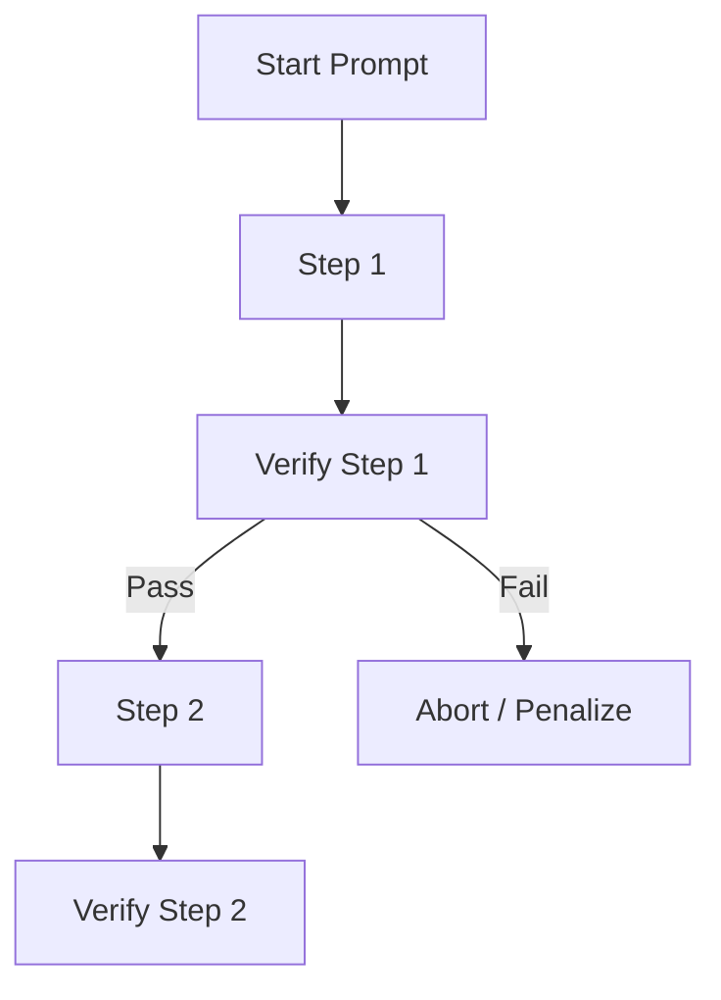

# Process-Verifiable Rewards (PVR)

PVR interleaves programmatic validation checks throughout the entire generation sequence.

## How it Works
1. Model generates intermediate steps.
2. Fast checking subroutines verify each step (e.g., intermediate tool executions, compiler passes).
3. The reward is dynamically generated step-by-step.

## Mermaid Flow Diagram

[Back to README](../README.md)
