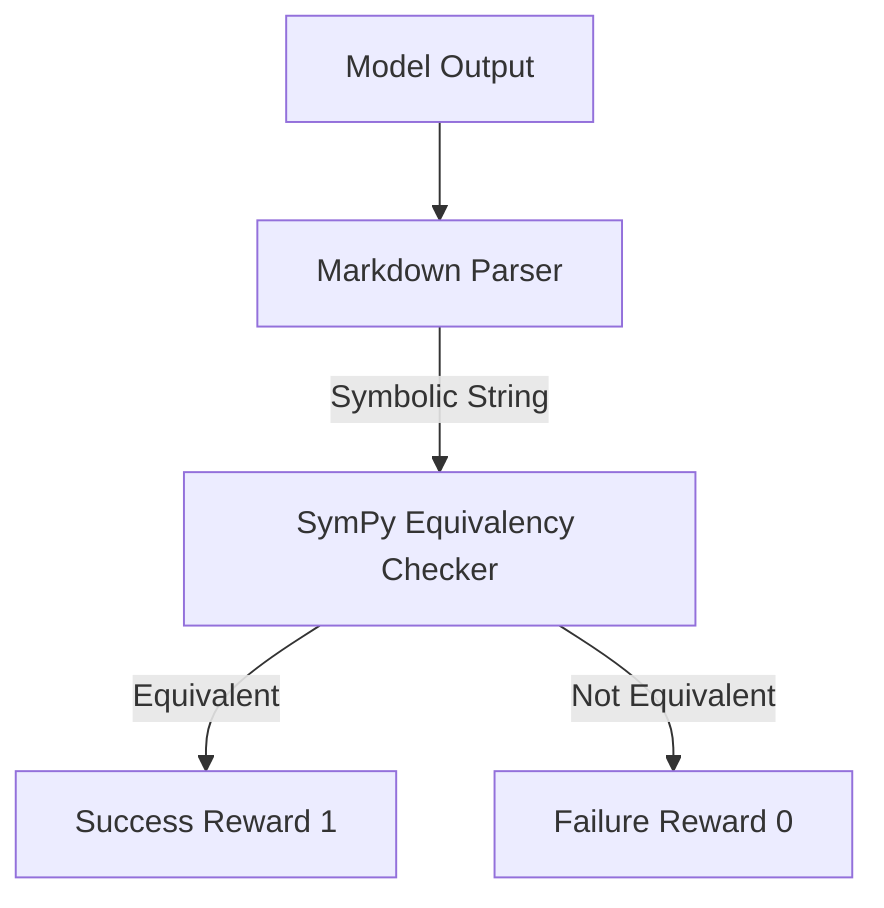

# Rule-Based Equivalency Checkers (Deterministic Math RLVR)

Checking final outputs against mathematical ground truths using symbolic math libraries like SymPy.

## How it Works
1. Agent outputs mathematical expressions.
2. Symbolic math engines check algebraic equivalence.
3. Correctly handles alternative representations (e.g., verifying 1/sqrt(2) equals sqrt(2)/2).

## Mermaid Flow Diagram

[Back to README](../README.md)
