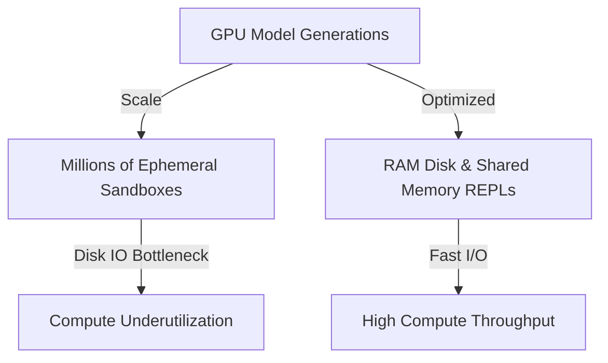

# Sandbox Container Latency and System I/O Overheads

Distributed scaling challenges from launching millions of sandbox test environments concurrently.

## How it Works
1. Container orchestration (e.g., Docker) creates heavy I/O overhead.
2. Mitigated by compiling verifiers into multi-threaded libraries.
3. Executing parsing and calculations directly in RAM disks / memory loops avoids disk bottlenecking.

## Mermaid Flow Diagram

[Back to README](../README.md)
