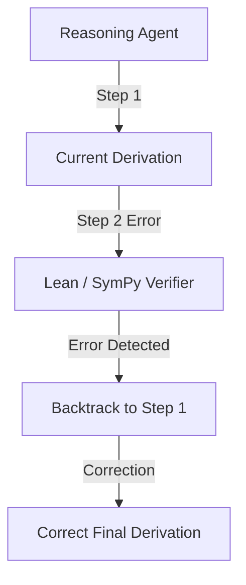

# Self-Correcting Quantitative Reasoning Models

Self-correction is reinforced by penalizing final failure but rewarding successful backtracking and debugging.

## How it Works
1. Model writes math derivations.
2. Rules checks verify step-by-step logic.
3. Model learns to identify contradictions, backtrack to earlier states, and correct errors natively.

## Mermaid Flow Diagram

[Back to README](../README.md)
