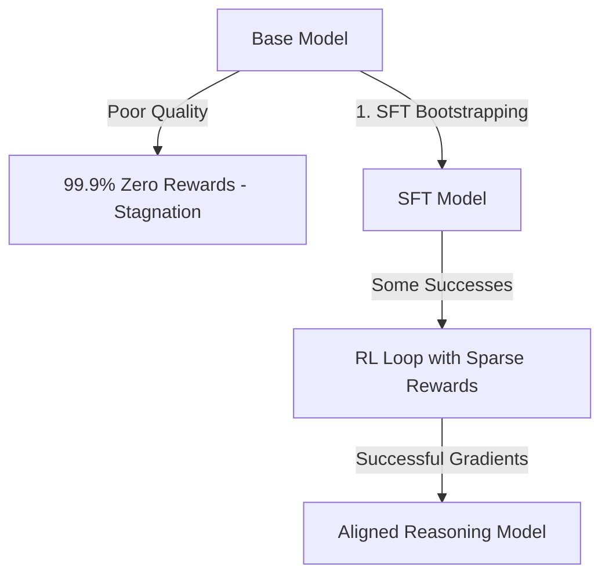

# The Sparse Gradient Stagnation Wall

Sparse gradients occur when binary rewards (0 or 1) result in almost all failures at the start of training, leaving the model with no optimization direction.

## How it Works
1. Bootstrapping with SFT (Supervised Fine-Tuning) initialization.
2. Training on high-quality pre-verified solutions ensures the base model can achieve a baseline success rate.
3. Enables RL optimization to proceed without flat plateaus.

## Mermaid Flow Diagram

[Back to README](../README.md)
